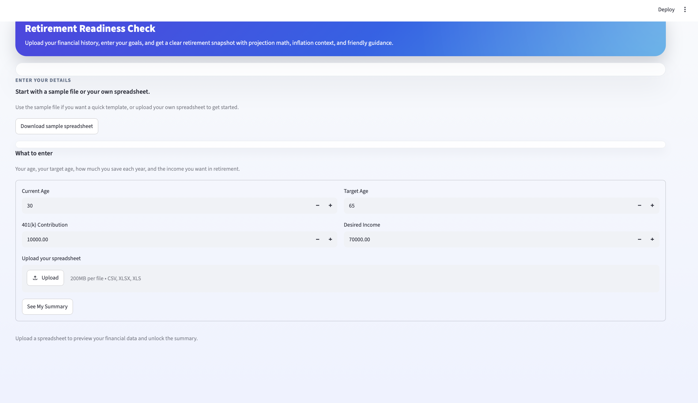
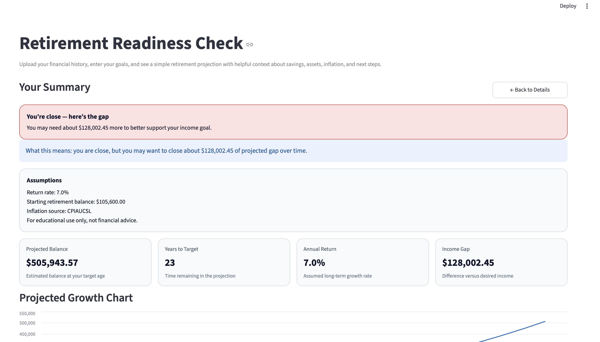
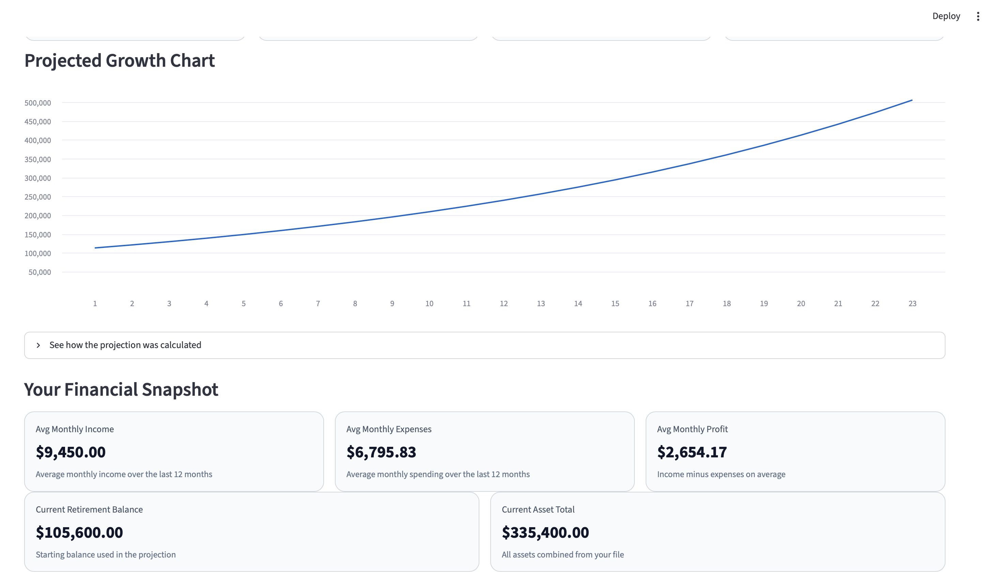
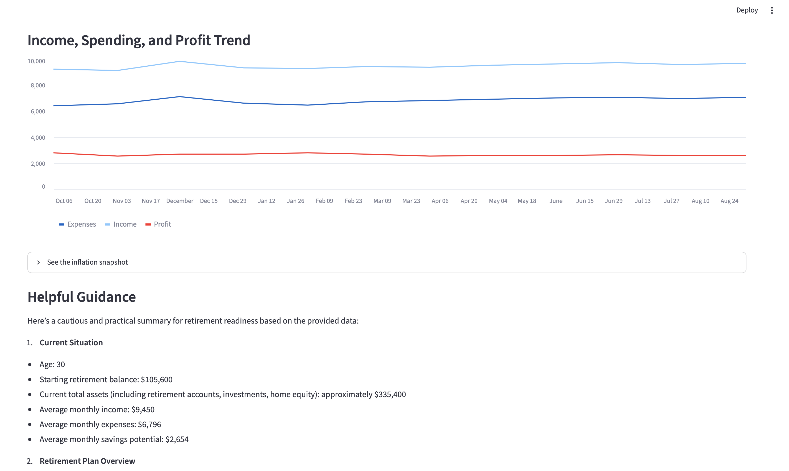
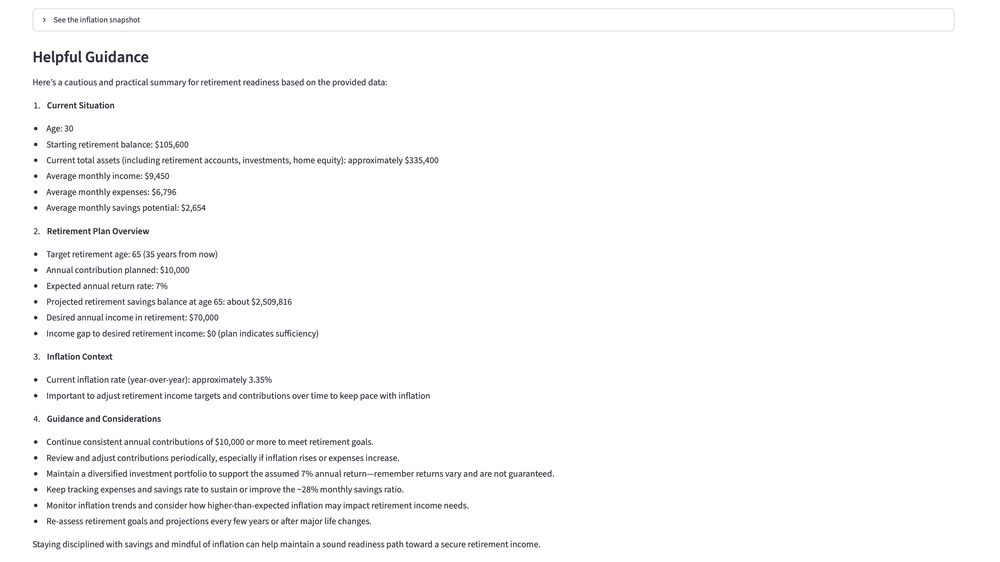

# Retirement Readiness Check

A week-one Streamlit app that helps a user upload financial history, enter retirement goals, and receive a simple retirement projection with inflation context and AI-generated guidance.

## What it does

## How This Works

- **Projection math**: The app uses a simple compound-growth model to estimate retirement balance from the user’s current age, target age, starting balance, and annual contribution.
- **FRED inflation context**: The app pulls CPI data from FRED so the user can see the current inflation backdrop alongside their projection.
- **LLM guidance**: The app sends the projection and financial snapshot to OpenAI to generate friendly, plain-English guidance and next-step suggestions.

- Upload a spreadsheet with monthly income, expenses, profits, retirement balances, and total assets.
- Enter current age, target age, 401(k) contribution, and desired retirement income.
- Generate a projection using deterministic math.
- Pull CPI inflation context from FRED.
- Produce friendly LLM guidance based on the uploaded data and projection.

## Why it matters

This app is built for a fast, approachable retirement readiness check. It is designed to show:

- where a user stands today,
- whether they appear on track,
- how much of a gap may remain,
- and what economic context may affect future purchasing power.

## Demo flow

1. Open the app.
2. Download the sample spreadsheet if needed.
3. Upload your own file or the sample file.
4. Enter your criteria.
5. Click **See My Summary**.
6. Review the on-track / gap status, projection cards, charts, inflation snapshot, and guidance.

## Sample data

The repository includes `sample_financial_data.csv` with realistic values for a 45-year-old profile. It includes:

- monthly income
- monthly expenses
- monthly profit
- 401(k) balance
- Roth IRA balance
- taxable investments
- cash savings
- home equity
- other assets
- total assets

## Tech stack

- Python
- Streamlit
- Pandas
- Fred API (`fredapi`)
- OpenAI API
- LangGraph

## Local setup

### 1) Create and activate the virtual environment

If your project already has `.venv`, activate it.

```bash
source .venv/bin/activate
```

### 2) Configure environment variables

Copy `.env.example` to `.env` and fill in your keys:

```bash
cp .env.example .env
```

Set:

- `FRED_API_KEY`
- `OPENAI_API_KEY`

Optional:

- `OPENAI_MODEL`

### 3) Install dependencies

If you are using `uv`:

```bash
uv sync
```

Or with `pip`:

```bash
pip install -r requirements.txt
```

### 4) Run the app

```bash
streamlit run app.py
```

## Tests

Run the unit tests with the project venv:

```bash
.venv/bin/python -m unittest discover -s tests
```

## Assumptions

- The math engine uses a fixed long-term annual return assumption unless changed in code.
- CPI inflation context is fetched from FRED when the API key is available.
- Guidance is educational and not personalized financial advice.

## Transparency

The app shows a short assumptions box on the Summary page so users can quickly see:

- the return rate used in the projection,
- the starting retirement balance,
- the inflation source,
- and the educational-use-only disclaimer.

## Screenshots

Add a couple of images here once you capture them from the running app:

*The input page with upload and criteria fields*
 

*The status card, assumptions box, and guidance*
 
 
 
 


If you want to include a short demo video or GIF, add it here as well:

- `screenshots/demo.gif`

## Project structure

- `app.py` — Streamlit interface and app flow
- `utils.py` — projection math, CSV handling, FRED integration, and OpenAI synthesis
- `sample_financial_data.csv` — demo spreadsheet
- `tests/` — unit tests for core utilities

## Notes

If you want to present this project, the strongest story is:

- a clear user uploads real financial history,
- the app produces an understandable retirement snapshot,
- and the guidance explains the result in plain English.
